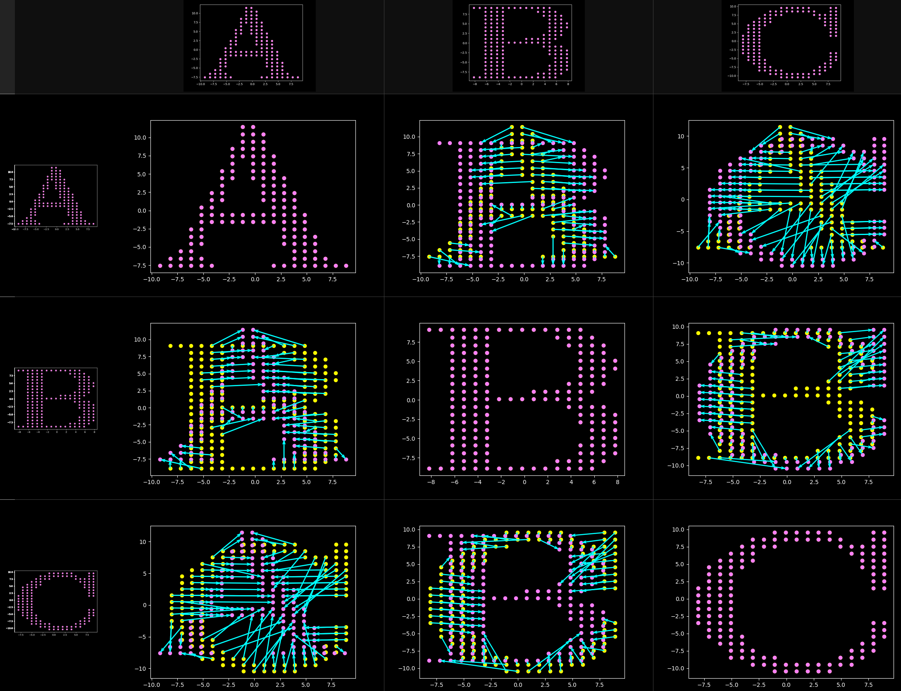

# Simple character recognition
## slides
* [please click here for slides](https://github.com/bcgov/bcgov-python-presentations/blob/master/presentations/20210526_simple_character_recognition/slides/20210526_arithmancy.pdf)
## details
Based on Earth-mover type distance.

1) Flood-fill segmentation
* most-prevalent color assumed to be "background" to be ignored
* characters to be classified are assumed to be of uniform color

2) Wasserstein "earth-mover" (inspired) distance
* simple nearest-centroid "supervised" classification, in the sense that the truth data are the "centroids" with respect to the "earth-mover" distance
* some robustness to noise or transformation offered, relative to truth data



## how to run
To generate the truth and test data:

```
python3 render.py
```

To perform flood-fill segmentation on truth and test:

```
python3 segment.py
```

To make a prediction on the test data:

```
python3 predict.py
```


